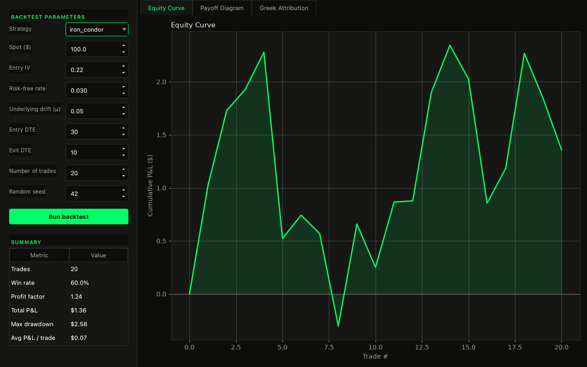
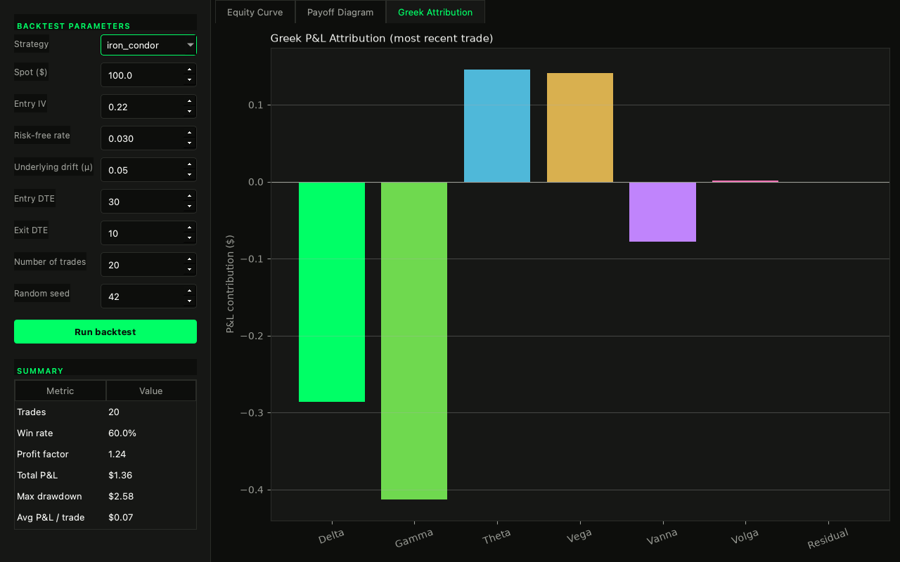
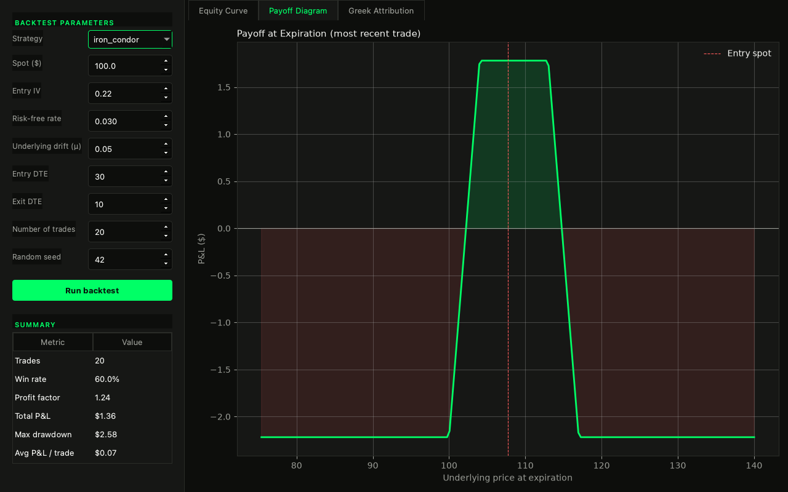

# vanna

A model-driven options pricing, Greeks, and backtesting library — named
after the real (if lesser-known) second-order Greek: the sensitivity of
delta to volatility. Desktop GUI included.

**[Try it live in your browser →](https://heykav.github.io/vanna/)**
No install, no server, no API key — it's the real Python engine running
client-side via [Pyodide](https://pyodide.org) (Python compiled to
WASM), not a JS reimplementation. `docs/vanna_src` is kept in sync with
`vanna/pricing` and `vanna/backtest` automatically
(`.github/workflows/sync-web-src.yml`), so that claim can't quietly go
stale.



## Why this exists

I went looking at [optopsy](https://github.com/goldspanlabs/optopsy) — a
genuinely good, actively maintained, 1.5k-star options backtesting
library — meaning to contribute a fix. What I actually came away with was
a different itch: optopsy's statistics are *empirical*. It buckets real
historical fills by DTE range and delta range and reports what happened
in each bucket. That's a legitimate, useful approach, and it's also just
not what I wanted, because it can tell you a trade made $340 without ever
telling you why - how much of that was the stock moving, how much was
time passing, how much was implied vol doing something ugly.

vanna prices everything from first principles instead - real
Black-Scholes, a real binomial tree for early exercise, a real implied-
vol solver - and then decomposes every trade's P&L into the Greeks that
actually explain it: delta, gamma, theta, vega, and the two second-order
ones most retail tooling never touches, vanna and volga. This is a
narrower, weirder thing to build than "another backtester," and I think
that's exactly what makes it worth having next to optopsy rather than
instead of it.

## What's actually novel here: Greek-attributed P&L

Every trade's profit or loss gets decomposed via a second-order Taylor
expansion of option value in (spot, vol, time):

```
dV ≈ Δ·dS + ½·Γ·dS² + Θ·dt + Vega·dσ + Vanna·dS·dσ + ½·Volga·dσ²
```

evaluated with the Greeks at the *start* of each period. The leftover -
actual P&L minus the sum of those six terms - is reported honestly as
`residual`, not folded into whichever bucket would make the chart look
cleanest. A real risk desk would never let third-order effects quietly
disappear into "vega P&L" just to make a pie chart sum to 100%, and
neither does this.



`tests/test_attribution.py` checks this isn't just algebra that happens
to balance: it verifies the residual actually shrinks roughly cubically
as the underlying/vol move shrinks (the real signature of a working
second-order Taylor expansion), and that a pure-spot move zeroes out
theta/vega/vanna/volga exactly rather than leaking into them.

## Pricing core - verified, not just transcribed

- **Black-Scholes + Greeks** (`vanna.pricing.black_scholes`): closed-form
  price, delta, gamma, theta, vega, rho, and the second-order vanna and
  volga. Every single Greek - including the two second-order ones - is
  cross-checked in the test suite against a centered finite difference of
  the lower-order terms. A transposed d1/d2 or a wrong sign in a formula
  copied from a textbook is an easy, quiet way to ship something subtly
  wrong; this way the tests catch it, not a user's P&L six months later.
- **Binomial tree** (`vanna.pricing.binomial`): Cox-Ross-Rubinstein tree
  for American-style exercise, which Black-Scholes structurally can't
  price. Verified to converge to Black-Scholes in the European limit, and
  to reproduce the textbook result that a deep-ITM American put is worth
  strictly more than its European counterpart (the early-exercise
  premium is a real, checkable number, not just a bigger number).
- **Implied volatility** (`vanna.pricing.implied_vol`): Newton-Raphson
  using vega as the derivative, falling back to bisection when vega is
  near zero (deep ITM/OTM, or close to expiry) and Newton would otherwise
  diverge or oscillate. Building this caught a real bug: the initial
  no-arbitrage floor used undiscounted intrinsic value (`K - S`), which
  is wrong for a European option - with enough time value of money, a
  correct European put price can trade *below* `K - S` and still be
  perfectly arbitrage-free. Fixed to use the properly discounted floor
  after a deep-ITM, long-dated test case caught it failing.

## Strategies

Ten, not thirty-eight - implemented and tested properly rather than
templated out: `long_call`, `short_call`, `long_put`, `short_put`,
`long_straddle`, `short_straddle`, `long_call_spread`,
`short_call_spread`, `iron_condor`, `covered_call`. Strikes are selected
by delta target against the model's own Black-Scholes surface, not
picked from a real chain (see below).

## What this deliberately doesn't do (yet)

- **No real historical market data.** By default, vanna simulates the
  underlying with geometric Brownian motion and prices every option in
  the chain directly from Black-Scholes, with a simple mean-reverting IV
  path so there's actually something for vega/vanna/volga to attribute.
  That means every example and test here is exactly reproducible from a
  seed with zero API keys or paid data subscriptions - and it means the
  backtests are only ever as realistic as GBM + a stylized vol process
  actually are. No smile dynamics, no jumps, no real fill data. optopsy's
  data CLI (with a real EODHD subscription) is the right tool if you need
  that; a real historical-chain loader here is a legitimate v2, not a
  hidden gap.
- **28 fewer strategies than optopsy.** On purpose - see above.
- **P&L is per-share, not per-contract.** Standard Black-Scholes
  convention; multiply displayed dollar figures by 100 for what a real
  100-share equity option contract would show.

## Quick start

```bash
git clone https://github.com/heykav/vanna.git
cd vanna
python3 -m venv .venv && source .venv/bin/activate
pip install -e ".[dev,gui]"
pytest -q                      # 87 tests
python main.py                 # launches the GUI
vanna iron_condor --trades 20  # or just use the CLI
```

```python
from vanna.pricing.black_scholes import price, greeks

price(S=100, K=100, T=0.25, r=0.03, sigma=0.22, is_call=True)
greeks(S=100, K=100, T=0.25, r=0.03, sigma=0.22, is_call=True).vanna

from vanna.backtest.engine import run_backtest
result = run_backtest("iron_condor", s0=100, iv0=0.22, r=0.03, mu=0.0,
                       entry_dte=30, exit_dte=10, n_trades=20, seed=42)
print(result.trades[-1].attribution)
```

## GUI

PySide6 + matplotlib, three tabs: the equity curve, the payoff diagram
for the most recently simulated trade, and its Greek attribution
breakdown.

| Payoff diagram | Greek attribution |
|---|---|
|  |  |

## Testing

```bash
pytest -q
```

87 tests: closed-form Greeks against finite differences and a textbook
reference price, the binomial tree against Black-Scholes convergence and
known early-exercise behavior, the IV solver recovering known vols
(including the low-vega cases that force the bisection fallback), the
attribution math's residual-shrinks-cubically property, and full
end-to-end backtest determinism/consistency checks. No GUI test
automation yet - the GUI was verified by actually launching it under
`QT_QPA_PLATFORM=offscreen`, running real backtests across single-leg,
multi-leg, and covered strategies, and inspecting real screenshots
(catching, along the way, a chart theme that was silently rendering
plain white instead of the dark theme it was supposed to have) - rather
than by an automated GUI test suite.

## License

MIT - optopsy is AGPL-3.0, and that's a real, deliberate difference, not
an oversight: this is meant to be freely embeddable in other projects
without copyleft obligations.

---

Made with ❤️ in India by Krishna Anubhav.
