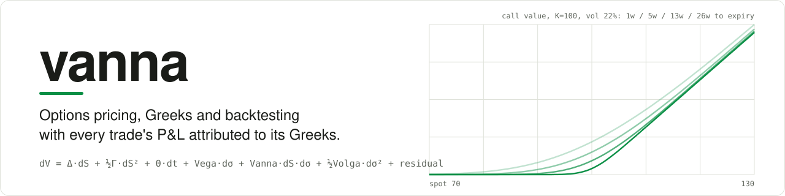
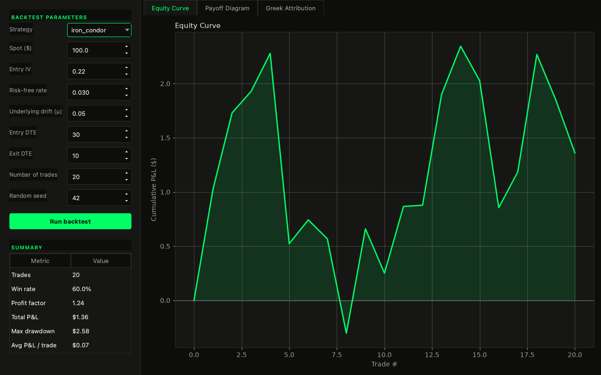
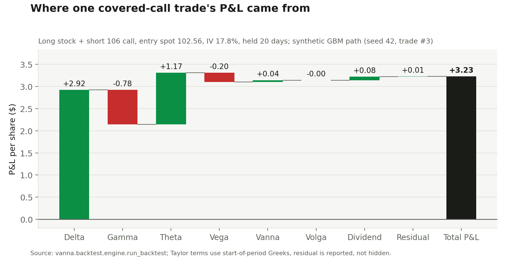
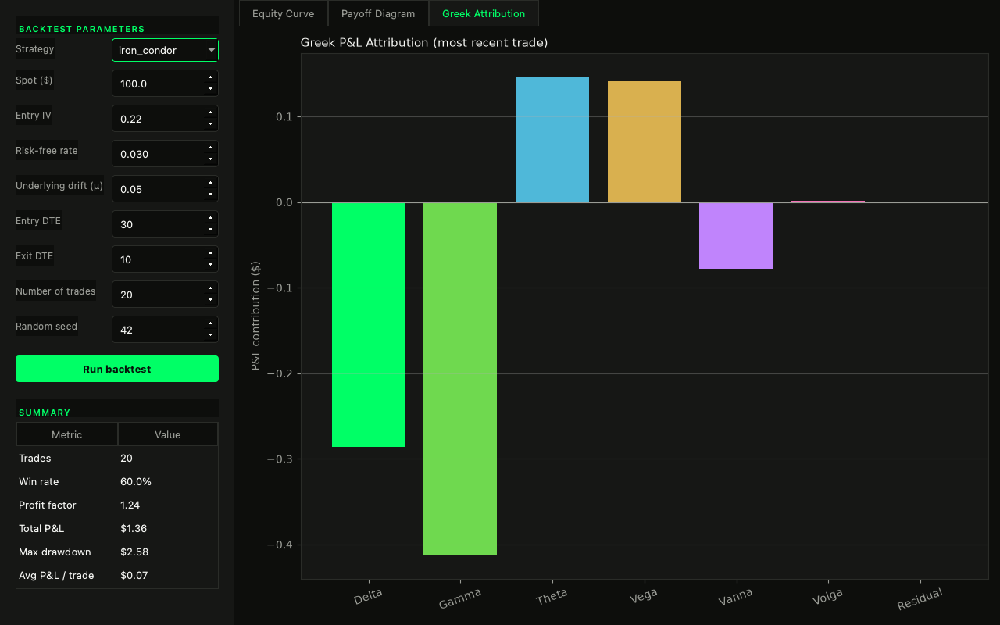
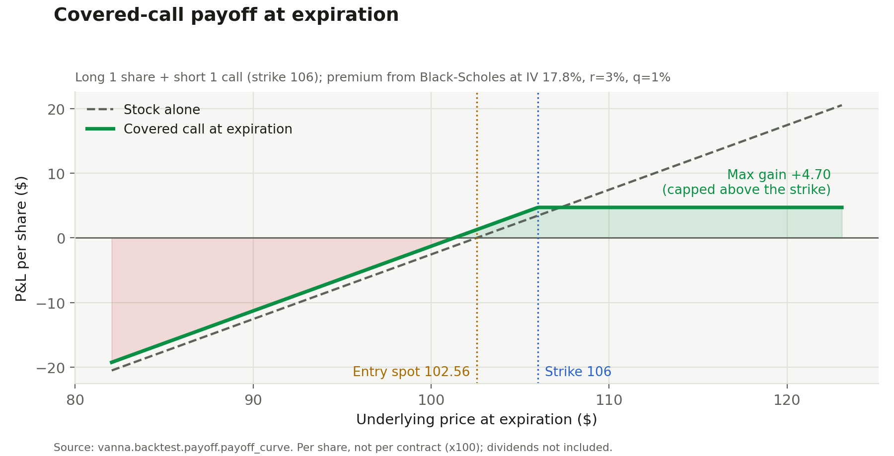
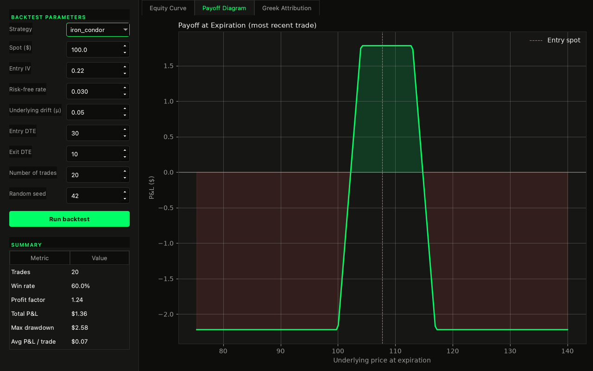

<p align="center">
<picture>
  <source media="(prefers-color-scheme: dark)" srcset="docs/img/hero-dark.svg">
  
</picture>
</p>

# vanna

A model-driven options pricing, Greeks, and backtesting library — named
after the real (if lesser-known) second-order Greek: the sensitivity of
delta to volatility. Desktop GUI included.

<p>
  <a href="https://heykav.github.io/vanna/"></a>
  &nbsp;&nbsp;
  <a href="#quick-start"></a>
  &nbsp;&nbsp;
  <a href="LICENSE"></a>
  &nbsp;&nbsp;
  <a href="#contributing"></a>
</p>

No install, no server, no API key needed to try it — the
[live demo](https://heykav.github.io/vanna/) runs the real Python engine
client-side via [Pyodide](https://pyodide.org) (Python compiled to
WASM), not a JS reimplementation. `docs/vanna_src` is kept in sync with
`vanna/pricing` and `vanna/backtest` automatically
(`.github/workflows/sync-web-src.yml`), so that claim can't quietly go
stale.

## What this is, and is not

**Is:** a small Python library for pricing single-name equity options
from first principles and for backtesting option strategies with the P&L
broken down by Greek.

- Black-Scholes-Merton price and Greeks (delta, gamma, vega, theta, rho,
  plus vanna and volga), a Cox-Ross-Rubinstein binomial tree for American
  exercise, and an implied-vol solver.
- A sequential strategy backtester (ten strategies) whose trades are
  attributed to delta, gamma, theta, vega, vanna, volga, dividends, and an
  explicit residual.
- Checked against QuantLib and py_vollib: see [docs/benchmarks.md](docs/benchmarks.md)
  for the measured accuracy and speed, including where vanna is slower.

**Is not:**

- **Not a historical backtester.** Backtests run on synthetic paths
  (geometric Brownian motion plus a stylised mean-reverting IV), so results
  are only as realistic as that model. There is no market-data loader.
- **Not for index, futures, or multi-asset options.** Single-name equity
  options only; European (closed form) and American (tree) exercise.
- **Dividends are a continuous yield only.** No discrete dividends,
  borrow curves, or term structures; rates and volatility are flat.
- **Not trading advice**, and not production-audited software.

## Quick start

`vanna` is not on PyPI yet. Install from source:

```bash
git clone https://github.com/heykav/vanna.git
cd vanna
python3 -m venv .venv && source .venv/bin/activate
pip install -e ".[dev,gui]"    # drop ",gui" if you only need the library
pytest -q
vanna iron_condor --trades 20  # CLI;  python main.py launches the GUI
```

```python
from vanna.pricing.black_scholes import price, greeks
from vanna.backtest.engine import run_backtest

price(S=100, K=100, T=0.25, r=0.03, sigma=0.22, is_call=True, q=0.01)
greeks(S=100, K=100, T=0.25, r=0.03, sigma=0.22, is_call=True).vanna

result = run_backtest("covered_call", s0=100, iv0=0.22, r=0.03, mu=0.0,
                      entry_dte=30, exit_dte=10, n_trades=20, seed=42, q=0.01)
print(result.trades[-1].attribution)
```

More: runnable scripts in [`examples/`](examples) (price and Greeks,
implied vol, covered-call backtest with attribution, dividends), and the
[API reference](docs/API.md).

**Names.** The distribution name in `pyproject.toml` is `vanna-greeks`,
because the PyPI name `vanna` belongs to an unrelated project (vanna-ai).
The import package and the CLI stay `vanna`. Nothing has been published; if
this is released, `pip install vanna-greeks` would be the command, and it
should not be installed into the same environment as the unrelated `vanna`
package, since both provide a top-level `vanna` module.



## Why this exists

I went looking at [optopsy](https://github.com/goldspanlabs/optopsy) — a
genuinely good, actively maintained, 1.5k-star options backtesting
library — meaning to contribute a fix. What I actually came away with was
a different itch: optopsy's statistics are *empirical*. It buckets real
historical fills by DTE range and delta range and reports what happened
in each bucket. That's a legitimate, useful approach, and it's also just
not what I wanted, because it can tell you a trade made $340 without ever
telling you why - how much of that was the stock moving, how much was
time passing, how much was implied vol doing something ugly.

vanna prices everything from first principles instead - real
Black-Scholes, a real binomial tree for early exercise, a real implied-
vol solver - and then decomposes every trade's P&L into the Greeks that
actually explain it: delta, gamma, theta, vega, and the two second-order
ones most retail tooling never touches, vanna and volga. This is a
narrower, weirder thing to build than "another backtester," and I think
that's exactly what makes it worth having next to optopsy rather than
instead of it.

## What's actually novel here: Greek-attributed P&L

Every trade's profit or loss gets decomposed via a second-order Taylor
expansion of option value in (spot, vol, time):

```
dV ≈ Δ·dS + ½·Γ·dS² + Θ·dt + Vega·dσ + Vanna·dS·dσ + ½·Volga·dσ²
```

evaluated with the Greeks at the *start* of each period. The leftover -
actual P&L minus the sum of those six terms - is reported honestly as
`residual`, not folded into whichever bucket would make the chart look
cleanest. A real risk desk would never let third-order effects quietly
disappear into "vega P&L" just to make a pie chart sum to 100%, and
neither does this.

<picture>
  <source media="(prefers-color-scheme: dark)" srcset="docs/img/attribution-dark.png">
  
</picture>

*One real trade (third trade of the `seed=42` covered-call run in
[`examples/`](examples), with a 1% dividend yield). The bars sum exactly to
the trade's P&L; the residual is the small leftover, shown rather than
hidden. Regenerate with `python scripts/make_figures.py`.*



`tests/test_attribution.py` checks this isn't just algebra that happens
to balance: it verifies the residual actually shrinks roughly cubically
as the underlying/vol move shrinks (the real signature of a working
second-order Taylor expansion), and that a pure-spot move zeroes out
theta/vega/vanna/volga exactly rather than leaking into them.

## Pricing core - verified, not just transcribed

<picture>
  <source media="(prefers-color-scheme: dark)" srcset="docs/img/accuracy-dark.png">
  
</picture>

*Measured on a 2,016-point European grid against QuantLib 1.43 and
py_vollib 1.0.12; the full tables, method and caveats (including where the
binomial tree is slower) are in [docs/benchmarks.md](docs/benchmarks.md).
This shows the formulas are transcribed correctly, not that
Black-Scholes fits any market.*

- **Black-Scholes + Greeks** (`vanna.pricing.black_scholes`): closed-form
  price, delta, gamma, theta, vega, rho, and the second-order vanna and
  volga. Every single Greek - including the two second-order ones - is
  cross-checked in the test suite against a centered finite difference of
  the lower-order terms. A transposed d1/d2 or a wrong sign in a formula
  copied from a textbook is an easy, quiet way to ship something subtly
  wrong; this way the tests catch it, not a user's P&L six months later.
- **Binomial tree** (`vanna.pricing.binomial`): Cox-Ross-Rubinstein tree
  for American-style exercise, which Black-Scholes structurally can't
  price. Verified to converge to Black-Scholes in the European limit, and
  to reproduce the textbook result that a deep-ITM American put is worth
  strictly more than its European counterpart (the early-exercise
  premium is a real, checkable number, not just a bigger number).
- **Implied volatility** (`vanna.pricing.implied_vol`): Newton-Raphson
  using vega as the derivative, falling back to bisection when vega is
  near zero (deep ITM/OTM, or close to expiry) and Newton would otherwise
  diverge or oscillate. Building this caught a real bug: the initial
  no-arbitrage floor used undiscounted intrinsic value (`K - S`), which
  is wrong for a European option - with enough time value of money, a
  correct European put price can trade *below* `K - S` and still be
  perfectly arbitrage-free. Fixed to use the properly discounted floor
  after a deep-ITM, long-dated test case caught it failing.

## Strategies

<picture>
  <source media="(prefers-color-scheme: dark)" srcset="docs/img/payoff-dark.png">
  
</picture>

*Covered-call payoff at expiration for the strikes and premium of the same
trade as above (per share).*

Ten, not thirty-eight - implemented and tested properly rather than
templated out: `long_call`, `short_call`, `long_put`, `short_put`,
`long_straddle`, `short_straddle`, `long_call_spread`,
`short_call_spread`, `iron_condor`, `covered_call` (long one share plus a short OTM call; the stock leg is
priced at spot and attributed entirely to delta). Strikes are selected
by delta target against the model's own Black-Scholes surface, not
picked from a real chain (see below).

## What this deliberately doesn't do (yet)

- **No real historical market data.** By default, vanna simulates the
  underlying with geometric Brownian motion and prices every option in
  the chain directly from Black-Scholes, with a simple mean-reverting IV
  path so there's actually something for vega/vanna/volga to attribute.
  That means every example and test here is exactly reproducible from a
  seed with zero API keys or paid data subscriptions - and it means the
  backtests are only ever as realistic as GBM + a stylized vol process
  actually are. No smile dynamics, no jumps, no real fill data. optopsy's
  data CLI (with a real EODHD subscription) is the right tool if you need
  that; a real historical-chain loader here is a legitimate v2, not a
  hidden gap.
- **28 fewer strategies than optopsy.** On purpose - see above.
- **P&L is per-share, not per-contract.** Standard Black-Scholes
  convention; multiply displayed dollar figures by 100 for what a real
  100-share equity option contract would show.

## GUI

PySide6 + matplotlib, three tabs: the equity curve, the payoff diagram
for the most recently simulated trade, and its Greek attribution
breakdown.

| Payoff diagram | Greek attribution |
|---|---|
|  |  |

## Testing

```bash
pytest -q
```

The test suite covers: closed-form Greeks against finite differences and a textbook
reference price, the binomial tree against Black-Scholes convergence and
known early-exercise behavior, the IV solver recovering known vols
(including the low-vega cases that force the bisection fallback), the
attribution math's residual-shrinks-cubically property, full end-to-end
backtest determinism/consistency checks, and input validation across
every entry point. No GUI test automation yet - the GUI was verified by
actually launching it under `QT_QPA_PLATFORM=offscreen`, running real
backtests across single-leg, multi-leg, and covered strategies, and
inspecting real screenshots (catching, along the way, a chart theme that
was silently rendering plain white instead of the dark theme it was
supposed to have) - rather than by an automated GUI test suite.

A real bug worth naming: a long enough simulated path (high `entry_dte`,
many trades, near-zero drift) can wander the underlying down under $1,
and `nearest_strike` used to round that down to a strike of exactly
`$0.0`, which then crashed pricing several calls away with a confusing
"K must be positive" error pointing nowhere near the actual cause. It
surfaced only once `validate_option_inputs` started actually being
called - which is itself the argument for validating at every boundary
rather than just at the ones that happen to get exercised by existing
tests. Fixed by flooring the rounded strike at one `strike_step`, with a
regression test that walks the exact scenario that found it.

## Security

- Every pricing/backtest entry point validates its inputs and fails with
  a specific message (`vanna.pricing.black_scholes.validate_option_inputs`,
  and the checks in `run_backtest`) instead of letting a bad value crash
  several calls deep with an unrelated error - or, worse, silently produce
  a wrong number.
- The web demo pins Subresource Integrity hashes on the Pyodide and
  Chart.js `<script>` tags and ships a Content-Security-Policy restricting
  script/style/connect sources to `'self'` plus that one CDN origin - so a
  compromised or tampered CDN response would be refused, not executed.
  `docs/app.js` also builds the summary table via DOM APIs rather than
  `innerHTML` string interpolation, on general principle even though
  every value going into it today is a computed number, not user text.
- See [`SECURITY.md`](SECURITY.md) for what this does *not* cover (SRI
  can't reach Pyodide's internally-fetched WASM/zip files; GitHub Pages
  doesn't allow custom response headers, so `frame-ancestors` genuinely
  isn't set) and how to report a vulnerability.

## Contributing

The most useful contribution here is a wrong number: if a Greek formula,
a strategy's strike selection, or the attribution math produces
something that doesn't hold up against a finite-difference check or a
known reference value, that's worth an issue or a PR more than a new
feature is. Before opening one:

1. Add a test that fails against the current behavior - "this Greek
   doesn't match a finite difference" or "this strategy's payoff shape
   is wrong" is a much more useful bug report than a description.
2. Run `pytest -q` and keep it green.
3. If you touch `vanna/pricing` or `vanna/backtest`, the web demo at
   `docs/vanna_src` updates itself via
   `.github/workflows/sync-web-src.yml` - you don't need to copy files
   by hand, and shouldn't hand-edit `docs/vanna_src` directly.

[Open an issue](https://github.com/heykav/vanna/issues/new) if you want
to talk through an idea before writing code.

## License

MIT - optopsy is AGPL-3.0, and that's a real, deliberate difference, not
an oversight: this is meant to be freely embeddable in other projects
without copyleft obligations.

---

Made with ❤️ in India by [Krishna Anubhav](https://github.com/heykav).
