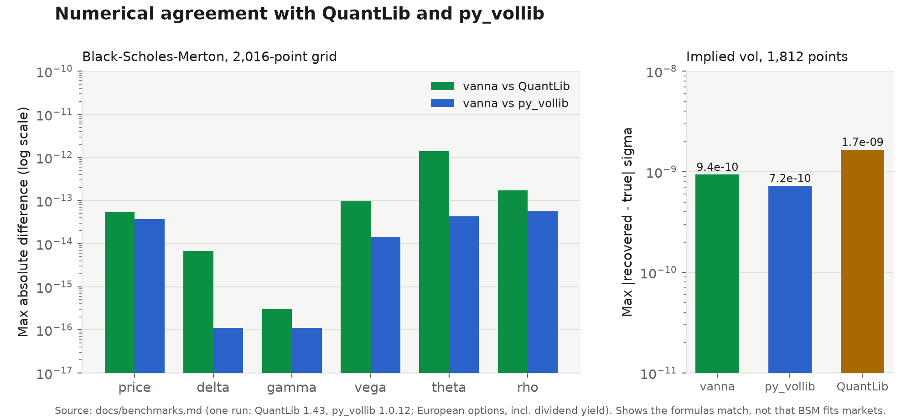
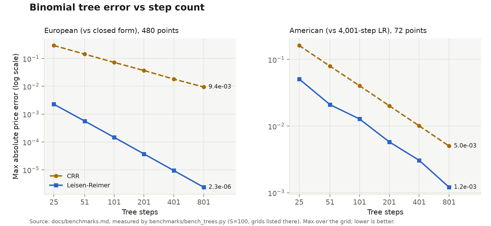

# Benchmarks: accuracy and speed against reference libraries

Everything below was measured locally by `benchmarks/bench_reference.py`
(one run, output pasted verbatim). Nothing is estimated or copied from
another source. Re-run it to get numbers for your own machine; timings in
particular vary by hardware and load, and the accuracy tables are
deterministic.

```bash
python -m venv .venv && source .venv/bin/activate
pip install -e . QuantLib py_vollib scipy
python benchmarks/bench_reference.py --json results.json
```

The benchmark is not part of the default `pytest` run. A small subset of it
lives in `tests/test_reference_quantlib.py` and is skipped automatically
when QuantLib is not installed.



*Figure: the `max abs` column of the tables below (regenerated by `scripts/make_figures.py`, which parses this file).*

## Method

- **References.** QuantLib 1.43 (`AnalyticEuropeanEngine`,
  `BinomialVanillaEngine` with the `crr` tree) and py_vollib 1.0.12
  (`black_scholes_merton`, whose implied vol uses `lets_be_rational`).
  mibian was installed but is not included: it only reports price/Greeks in
  rounded percent-and-days units and would add nothing beyond py_vollib.
- **Conventions aligned.** T = calendar days / 365 (QuantLib
  `Actual365Fixed`, `NullCalendar`, so there is no day-count ambiguity).
  All values are compared in vanna's units: vega per 1.00 of sigma, rho per
  1.00 of r, theta per year of calendar time (`-dV/dT`). py_vollib reports
  vega/rho per 1% and theta per day; these were rescaled (x100, x100, x365).
  With those conversions there is **no convention discrepancy** for
  European options.
- **European grid (2,016 points).** S = 100; K in {70, 80, 90, 100, 110,
  120, 130}; sigma in {0.10, 0.20, 0.40, 0.80}; r in {0, 2%, 5%}; expiry in
  {7, 30, 90, 180, 365, 730} days; q in {0, 3%}; call and put.
- **Implied vol.** Take the QuantLib price at a known sigma, ask each
  solver to recover sigma, report `|recovered - sigma|`. Points whose time
  value is below 1e-8 (204 of 2,016) are skipped: the price carries no
  volatility information at double precision, so no solver can be judged.
  No solver failed on the remaining 1,812.
- **American grid (144 points).** S = 100; K in {90, 100, 110}; sigma in
  {0.20, 0.40}; r in {2%, 5%}; expiry in {30, 180, 365} days; q in {0, 3%};
  call and put; 200-step CRR tree (vanna's default).
- **Relative error** is only computed where the reference value has
  magnitude above 1e-4 (otherwise it measures noise in a near-zero number);
  the count is not shown per row but the absolute columns cover every point.
- **Timing.** Median of repeated batches, single thread, one representative
  ATM 6-month call. This is per-call Python latency, not throughput.

## Results

### Environment

- python: 3.11.15
- platform: Linux-6.18.44-fc-v50-x86_64-with-glibc2.39
- cpu: Intel(R) Xeon(R) Processor @ 2.10GHz
- vanna: 0.1.0
- QuantLib: 1.43
- py_vollib: 1.0.12
- lets_be_rational: 1.1.2
- numpy: 2.4.6

European grid: 2016 points; American grid: 144 points

### European: Black-Scholes-Merton

| comparison | n | max abs | mean abs | max rel | mean rel | worst case |
|---|---:|---:|---:|---:|---:|---|
| vanna vs QuantLib: price | 2016 | 5.33e-14 | 6.94e-15 | 3.58e-11 | 2.69e-13 | K=130.0 vol=0.2 r=0.05 d=90 q=0.03 P |
| vanna vs QuantLib: delta | 2016 | 6.77e-15 | 2.13e-16 | 5.92e-13 | 4.17e-15 | K=100.0 vol=0.1 r=0.02 d=7 q=0.0 P |
| vanna vs QuantLib: gamma | 2016 | 3.02e-16 | 1.36e-17 | 1.86e-13 | 4.14e-15 | K=110.0 vol=0.4 r=0.02 d=7 q=0.03 C |
| vanna vs QuantLib: vega | 2016 | 9.59e-14 | 7.20e-15 | 1.81e-13 | 6.48e-15 | K=110.0 vol=0.1 r=0.0 d=365 q=0.03 C |
| vanna vs QuantLib: theta | 2016 | 1.39e-12 | 4.63e-14 | 3.47e-12 | 2.96e-14 | K=130.0 vol=0.1 r=0.02 d=7 q=0.03 P |
| vanna vs QuantLib: rho | 2016 | 1.71e-13 | 9.45e-15 | 1.38e-12 | 9.81e-15 | K=100.0 vol=0.1 r=0.02 d=730 q=0.0 C |
| vanna vs py_vollib: price | 2016 | 3.73e-14 | 5.73e-15 | 2.32e-13 | 4.38e-15 | K=110.0 vol=0.4 r=0.02 d=30 q=0.0 P |
| py_vollib vs QuantLib: price | 2016 | 4.62e-14 | 5.36e-15 | 3.59e-11 | 2.69e-13 | K=130.0 vol=0.4 r=0.02 d=7 q=0.03 P |
| vanna vs py_vollib: delta | 2016 | 1.11e-16 | 1.87e-17 | 2.94e-15 | 1.73e-16 | K=70.0 vol=0.1 r=0.0 d=7 q=0.03 C |
| py_vollib vs QuantLib: delta | 2016 | 6.77e-15 | 2.12e-16 | 5.90e-13 | 4.15e-15 | K=100.0 vol=0.1 r=0.02 d=7 q=0.0 P |
| vanna vs py_vollib: gamma | 2016 | 1.11e-16 | 7.83e-19 | 4.54e-16 | 5.42e-17 | K=100.0 vol=0.1 r=0.0 d=7 q=0.03 C |
| py_vollib vs QuantLib: gamma | 2016 | 2.98e-16 | 1.34e-17 | 1.86e-13 | 4.12e-15 | K=110.0 vol=0.4 r=0.02 d=7 q=0.03 C |
| vanna vs py_vollib: vega | 2016 | 1.42e-14 | 8.47e-16 | 5.16e-16 | 6.15e-17 | K=90.0 vol=0.2 r=0.0 d=730 q=0.0 C |
| py_vollib vs QuantLib: vega | 2016 | 9.59e-14 | 7.22e-15 | 1.81e-13 | 6.47e-15 | K=110.0 vol=0.1 r=0.0 d=365 q=0.03 C |
| vanna vs py_vollib: theta | 2016 | 4.26e-14 | 8.66e-16 | 1.75e-14 | 1.26e-16 | K=110.0 vol=0.8 r=0.02 d=7 q=0.03 C |
| py_vollib vs QuantLib: theta | 2016 | 1.39e-12 | 4.64e-14 | 3.47e-12 | 2.96e-14 | K=130.0 vol=0.1 r=0.02 d=7 q=0.03 P |
| vanna vs py_vollib: rho | 2016 | 5.68e-14 | 1.84e-15 | 3.18e-15 | 2.27e-16 | K=130.0 vol=0.2 r=0.02 d=730 q=0.03 P |
| py_vollib vs QuantLib: rho | 2016 | 1.71e-13 | 9.52e-15 | 1.39e-12 | 9.82e-15 | K=100.0 vol=0.1 r=0.02 d=730 q=0.0 C |
| implied vol (vanna) vs true sigma | 1812 | 9.37e-10 | 5.02e-12 | 9.37e-09 | 3.99e-11 | K=130.0 vol=0.1 r=0.05 d=90 q=0.03 P |
| implied vol (py_vollib) vs true sigma | 1812 | 7.24e-10 | 3.38e-12 | 7.24e-09 | 2.69e-11 | K=130.0 vol=0.1 r=0.0 d=90 q=0.0 P |
| implied vol (QuantLib) vs true sigma | 1812 | 1.66e-09 | 4.66e-12 | 1.66e-08 | 3.86e-11 | K=130.0 vol=0.1 r=0.0 d=90 q=0.03 P |

Implied-vol failures (no root returned): {'vanna': 0, 'py_vollib': 0}; grid points skipped as ill-posed (time value < 1e-8): 204

### American: binomial

| comparison | n | max abs | mean abs | max rel | mean rel | worst case |
|---|---:|---:|---:|---:|---:|---|
| vanna(200) vs QuantLib CRR(200): price | 144 | 3.98e-04 | 6.02e-05 | 3.65e-05 | 5.32e-06 | K=90.0 vol=0.2 r=0.05 d=365 q=0.0 C |
| vanna(200) vs QuantLib CRR(2000): price | 144 | 1.76e-02 | 5.35e-03 | 1.36e-02 | 1.16e-03 | K=100.0 vol=0.4 r=0.02 d=365 q=0.0 C |
| QuantLib CRR(200) vs QuantLib CRR(2000): price | 144 | 1.79e-02 | 5.36e-03 | 1.36e-02 | 1.16e-03 | K=100.0 vol=0.4 r=0.02 d=365 q=0.0 C |
| vanna(200) vs QuantLib CRR(200): delta | 144 | 1.23e-05 | 1.46e-06 | 2.65e-05 | 3.01e-06 | K=100.0 vol=0.2 r=0.05 d=365 q=0.0 C |
| vanna(200) vs QuantLib CRR(2000): delta | 144 | 9.94e-04 | 1.26e-04 | 1.29e-02 | 6.92e-04 | K=110.0 vol=0.2 r=0.05 d=30 q=0.0 P |
| vanna(200) vs QuantLib CRR(200): gamma | 144 | 1.14e-06 | 4.90e-08 | 4.09e-05 | 2.82e-06 | K=110.0 vol=0.2 r=0.05 d=365 q=0.0 P |
| vanna(200) vs QuantLib CRR(2000): gamma | 144 | 6.59e-03 | 9.85e-05 | 2.64e-01 | 4.24e-03 | K=110.0 vol=0.2 r=0.05 d=30 q=0.0 P |
| vanna(200) vs QuantLib CRR(200): theta | 144 | 1.81e+00 | 1.38e-02 | 1.00e+00 | 7.10e-03 | K=110.0 vol=0.2 r=0.05 d=30 q=0.0 P |
| vanna(200) vs QuantLib CRR(2000): theta | 144 | 4.98e-01 | 2.49e-02 | 1.00e+00 | 9.49e-03 | K=110.0 vol=0.2 r=0.05 d=30 q=0.0 P |
| vanna(200) theta vs time-difference of QuantLib CRR(2000) price | 144 | 5.06e-01 | 8.05e-02 | 1.00e+00 | 1.64e-02 | K=110.0 vol=0.4 r=0.05 d=180 q=0.0 C |
| vanna binomial(european, 200) vs vanna closed form: price | 144 | 1.96e-02 | 6.30e-03 | 1.48e-02 | 1.35e-03 | K=100.0 vol=0.4 r=0.02 d=365 q=0.0 P |

### Timing (median seconds per call, single thread)

| operation | implementation | time per call |
|---|---|---:|
| BS price | vanna | 1.0 us |
| BS price | py_vollib | 3.8 us |
| BS price | QuantLib (reused instrument) | 3.3 us |
| BS price | QuantLib (build instrument per call) | 53.7 us |
| all Greeks (delta,gamma,vega,theta,rho) | vanna (greeks(), also gives vanna+volga) | 3.4 us |
| all Greeks (delta,gamma,vega,theta,rho) | py_vollib (5 separate calls) | 12.1 us |
| all Greeks (delta,gamma,vega,theta,rho) | QuantLib (reused instrument) | 5.6 us |
| implied vol (ATM, well-conditioned) | vanna | 13.7 us |
| implied vol (ATM, well-conditioned) | py_vollib (lets_be_rational) | 30.9 us |
| implied vol (ATM, well-conditioned) | QuantLib | 15.5 us |
| American price, CRR 200 steps | vanna (numpy-vectorised tree) | 923.1 us |
| American price, CRR 200 steps | QuantLib (incl. building option) | 268.6 us |
| American delta/gamma/theta, 200 steps | vanna (greeks_binomial: one tree, price+delta+gamma+theta) | 890.3 us |
| American delta/gamma/theta, 200 steps | QuantLib (tree-native) | 269.3 us |

## Reading the results

**Closed-form Black-Scholes-Merton agrees with both references to machine
precision** (max absolute error around 1e-12 or better for every quantity,
including theta and rho, with dividends). This is what one would expect from
the same formula evaluated in double precision, and it means the unit and
sign conventions in `vanna.pricing.black_scholes` are the standard ones. It
is a check that the formulas are transcribed correctly, not evidence that
Black-Scholes is a good model of any market.

**Implied vol** now agrees with py_vollib and QuantLib to about 1e-9 in
sigma on this grid. This benchmark found a real defect in the previous
solver: it stopped when the *price* residual fell below 1e-6 (bisection) or
1e-8 (Newton), which at low vega leaves sigma far off. On this grid the old
code was off by more than 1e-6 in sigma at 82 of the 1,812 points, and by
up to 9.3e-3 (0.93 vol points) for a one-week 30%-OTM option with vega about
1e-4. The solver now also requires the Newton step in sigma to be negligible
and bisects on interval width in sigma. `bisection_tol` therefore now means
a width in sigma (default 1e-10), not a price tolerance.
`tests/test_pricing_accuracy.py` pins this case.

A second pass (the safeguarded solver described in
`vanna/pricing/implied_vol.py`) was measured on a wider grid in
[Tree convergence and implied-vol robustness](#tree-convergence-and-implied-vol-robustness)
below: out to 1-day expiries, 1% and 400% vol, 4x OTM strikes and negative
rates, it has no point whose sigma error exceeds 10x what the price's own
rounding error allows (the previous solver had 8 such points on that grid,
the worst off by 6.7e-6 for a 1-day, 400-strike, 400%-vol call). The
closed-form pricer also stopped underflowing: `N(x)` was computed as
`0.5 * (1 + erf(x / sqrt 2))`, which is exactly 0 for x below about -8.3,
so a 30-day 2x-OTM call priced as 0.0 (true value 5.7e-34) and the old
solver returned sigma = 0.156 for it; it now uses `erfc` and keeps full
relative precision in the tail. These are covered by
`tests/test_numerical_precision.py` and `tests/test_implied_vol_robustness.py`.

**Binomial American price.** vanna's 200-step CRR price agrees with
QuantLib's 200-step CRR to 4e-4 absolute (they are the same model up to
differences in how the up-probability and node spots are computed). Both
are 200-step approximations: against QuantLib's 2,000-step tree the error
is up to about 1.8e-2 for either, so treat the tree price as good to roughly
a cent or two at this step count, and raise `steps` if you need more. The
tree oscillates with step count; it is not monotone.

**Binomial Greeks were inaccurate and are fixed.** The first run of this
benchmark showed the old bump-and-reprice `greeks_binomial` disagreeing
badly with QuantLib: gamma off by up to 0.54 in absolute terms and delta by
up to 0.018, with theta off by up to about 1 to 2 per year. The cause is that a
tree price is a lattice function of spot, and a bump of 0.1% of spot is much
smaller than the node spacing (around 2%), so finite differences measured
lattice noise. Greeks are now read from the first layers of the same tree
(Hull's method): delta and gamma agree with QuantLib's 200-step tree to
about 1e-5 and 1e-6 (max), and one call is one tree instead of seven.

**Binomial theta needs a caveat.** In the continuation region, vanna's tree
theta agrees with QuantLib's to well under 1% relative (spot-checked on four points, not over the whole grid). Deep in the
early-exercise region (for example a 110-strike put at S = 100) the two
libraries genuinely disagree: vanna reports 0 (the option is worth
`K - S`, which does not decay), while QuantLib reports a positive number
because it derives theta from the Black-Scholes PDE identity, which does not
hold where exercise is optimal. A time-difference of a 2,000-step QuantLib
price is a fairer reference; against it vanna's 200-step theta still has a
worst-case absolute error of about 0.5 per year and up to 100% relative
error near the exercise boundary. Tree theta at 200 steps is a coarse
estimate; use more steps or a PDE method if you rely on it.

## Speed

Numbers are in the table above; on this machine:

- vanna's closed-form price, Greeks and implied vol are faster per call than
  py_vollib and QuantLib called from Python. That is mostly Python call
  overhead: QuantLib's C++ engine is fast, but each call crosses the SWIG
  boundary and touches quote/handle objects, and building a fresh
  instrument per call costs about 50 us. If you already reuse a
  QuantLib instrument, its 3 us price is close to vanna's 1 us. vanna's
  `greeks()` also returns vanna and volga, which the others do not compute
  in these calls.
- **The binomial tree is where vanna is slower.** A 200-step American price
  takes about 0.9 ms against roughly 0.27 ms for QuantLib's C++ tree, i.e.
  about 3.4x slower. (It was about 1.7-1.8 ms, 7x slower, before the
  backward induction stopped recomputing node spots with a power at every
  step; see the before/after table below.) Pricing a large chain of
  American options with vanna will still be noticeably slower than with
  QuantLib.

## Caveats

- One machine, one run; timings are indicative only. The environment block
  above lists the hardware and versions used.
- Agreement with references shows numerical correctness of the formulas and
  tree, not model realism. vanna assumes constant rates, a constant
  continuous dividend yield and flat volatility.
- The grid is finite. Extreme inputs (very short expiries with very
  low vol, tiny option values) are covered only partly; the skipped
  implied-vol points are listed above.
- American exercise is priced with a binomial tree (CRR or Leisen-Reimer)
  only. Discrete dividends, calendars, and holidays are not modelled, and
  none of that is tested here.
- QuantLib and py_vollib are benchmark-only dependencies; vanna itself
  depends only on numpy.

## Tree convergence and implied-vol robustness

Measured by `benchmarks/bench_trees.py` (numpy only, no reference library;
output pasted verbatim below, one run on the machine listed). References:
the closed form for European options; for American options a 4,001-step
Leisen-Reimer tree, whose own error is estimated by comparing it with an
8,001-step one. The Leisen-Reimer tree was also checked against QuantLib
1.43's `BinomialVanillaEngine("lr")` at 1,001 steps: price, delta and gamma
agree to 2.1e-10, 2.4e-12 and 1.6e-12 over 288 points (American and
European); `tests/test_reference_quantlib.py` keeps a subset. At some other
step counts (201, 1,501) QuantLib's *American* LR price differs from
vanna's by up to 0.06 while its European price still agrees to 2e-10, and
in the worst case QuantLib's American price is below its own European
price for a no-dividend call, which cannot be right; those step counts were
not used as a reference.



*Figure: the `max` columns of the first and third tables below (regenerated by `scripts/make_figures.py`, which parses this file).*

#### Environment

- python 3.11.15, Linux-6.18.44-fc-v50-x86_64-with-glibc2.39, processor: x86_64
- numpy 2.4.6

#### European price error vs closed form (480 points)

| steps | CRR max | CRR mean | LR max | LR mean |
|---:|---:|---:|---:|---:|
| 25 | 2.92e-01 | 6.01e-02 | 2.27e-03 | 6.35e-04 |
| 51 | 1.43e-01 | 3.28e-02 | 5.63e-04 | 1.57e-04 |
| 101 | 7.21e-02 | 1.64e-02 | 1.46e-04 | 4.07e-05 |
| 201 | 3.69e-02 | 8.76e-03 | 3.71e-05 | 1.04e-05 |
| 401 | 1.81e-02 | 4.20e-03 | 9.36e-06 | 2.61e-06 |
| 801 | 9.43e-03 | 2.16e-03 | 2.35e-06 | 6.56e-07 |

#### European tree Greeks vs closed form, 201 steps (480 points)

| Greek | error | CRR max | CRR mean | LR max | LR mean |
|---|---|---:|---:|---:|---:|
| delta | abs | 9.14e-04 | 1.82e-04 | 6.67e-04 | 2.94e-04 |
| gamma | rel | 2.09e-01 | 7.19e-03 | 1.30e-01 | 9.63e-03 |
| theta | rel | 2.09e-01 | 5.76e-03 | 7.80e-02 | 3.48e-03 |

#### American price error vs 4,001-step LR reference (72 points)

Reference self-convergence gap (|LR 4001 - LR 8001|): max 1.56e-04, mean 1.73e-05.

| steps | CRR max | CRR mean | LR max | LR mean |
|---:|---:|---:|---:|---:|
| 25 | 1.62e-01 | 4.30e-02 | 5.09e-02 | 5.45e-03 |
| 51 | 7.93e-02 | 3.04e-02 | 2.10e-02 | 2.53e-03 |
| 101 | 4.03e-02 | 1.10e-02 | 1.28e-02 | 1.30e-03 |
| 201 | 2.02e-02 | 6.13e-03 | 5.80e-03 | 6.41e-04 |
| 401 | 1.01e-02 | 2.75e-03 | 3.07e-03 | 3.09e-04 |
| 801 | 5.03e-03 | 1.52e-03 | 1.21e-03 | 1.34e-04 |

#### Implied vol round trip (4536 grid points)

- solved: 2942
- skipped: 1594
- failures: 0
- max_abs_err: 3.98e-05
- mean_abs_err: 4.44e-08
- worse_than_10x_conditioning: 0
- mean_newton_evals: 7.10e+00
- mean_us_per_solve (single pass, includes counting overhead): 3.00e+01

#### Timing (median per call, this machine)

| operation | time |
|---|---:|
| BS price | 1.0 us |
| BS greeks() | 3.2 us |
| implied_vol, ATM | 12.7 us |
| American put, CRR 201 steps | 903.7 us |
| American put, LR 201 steps | 879.9 us |
| greeks_binomial, CRR 201 steps | 878.1 us |
| run_backtest iron_condor, 50 trades | 71,425.0 us |

### Reading these results

- **European options: Leisen-Reimer is far more accurate than CRR at the
  same step count** on this grid: max error 130x lower at 25 steps, about
  1,000x lower at 201 (3.7e-5 vs 3.7e-2) and 4,000x lower at 801, and its error falls by about 4x per doubling of steps (O(1/n^2)),
  against 2x for CRR. It costs the same per step.
- **American options: the gain is smaller but real.** LR's max error is
  3-4x below CRR's at every step count and its mean error 8-12x below; both
  now converge at roughly O(1/n), because the early-exercise boundary is
  not aligned with the nodes in either lattice. The reference's own
  uncertainty (the gap between 4,001 and 8,001 LR steps, max 1.6e-4) is
  comparable to the LR error at 801 steps, so the last row does not
  resolve LR's error.
- **Tree Greeks do not improve much.** At 201 steps LR has the lower max
  error for delta, gamma and theta and the lower mean error for theta, but
  a higher mean error for delta and gamma; all within a factor of about 2
  of CRR. LR's middle step-2 node is not at the spot (u*d != 1), so
  theta must be shifted back to S with the step-2 delta and gamma; without
  that correction LR theta is off by 59-90% in the case pinned in
  `tests/test_binomial_properties.py`.
- The default stays `method="crr"` so existing results do not change;
  pass `method="lr"` for better prices at the same cost.
- **Implied vol:** all 2,942 well-posed points solved, none worse than 10x
  its conditioning limit. The max absolute error (4e-5) is at a point where
  the price's rounding error alone allows about that much (the 10x check
  is the meaningful one). "Skipped" are points whose time value is below
  1e-12 x S, where the price carries no volatility information in double
  precision.

### Before/after timings

`benchmarks/bench_perf.py` uses only APIs present both before and after this
change, so it was run on the parent commit (5a46a34) and on this version,
three times each, alternating, on the machine above. The table shows the
median of the three runs (microseconds per call). Timings on a shared
machine are noisy; differences of 10-20% are within noise.

| operation | before (us) | after (us) | change |
|---|---:|---:|---|
| BS price | 1.1 | 1.1 | same |
| BS greeks() | 3.4 | 3.1 | same (noise) |
| implied_vol, ATM | 11.8 | 12.5 | ~6% slower (bound checks, one more log) |
| implied_vol, 1-week 30% OTM | 49.5 | 24.1 | 2.1x faster |
| implied_vol, mean over the 2,942-point grid | 36.2 | 28.2 | 1.3x faster |
| American put, CRR 200 steps | 1,729.5 | 868.8 | 2.0x faster |
| greeks_binomial, CRR 200 steps | 1,713.9 | 898.8 | 1.9x faster |
| run_backtest iron_condor, 50 trades | 117,002.9 | 68,380.5 | 1.7x faster |

The tree speed-up comes from updating node spots by one multiplication per
step instead of recomputing `S * u ** k` for every node; the CRR prices are
unchanged to 7e-13. The backtest speed-up comes from strike selection
(`nearest_strike`) calling a delta-only function instead of `greeks()` for
each of ~100 candidate strikes; the delta values are bit-identical.
